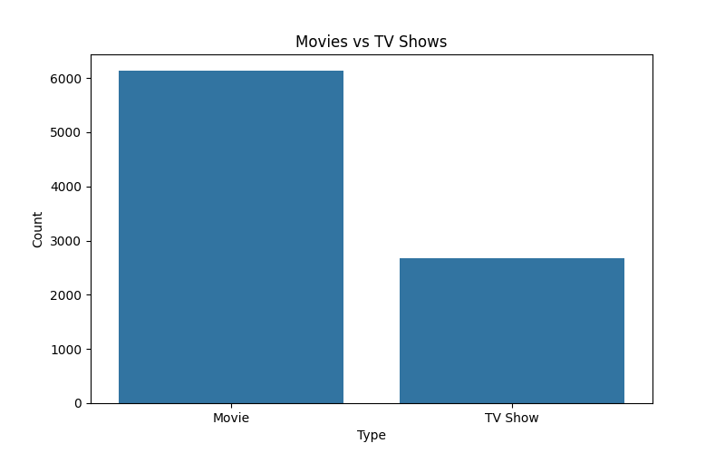
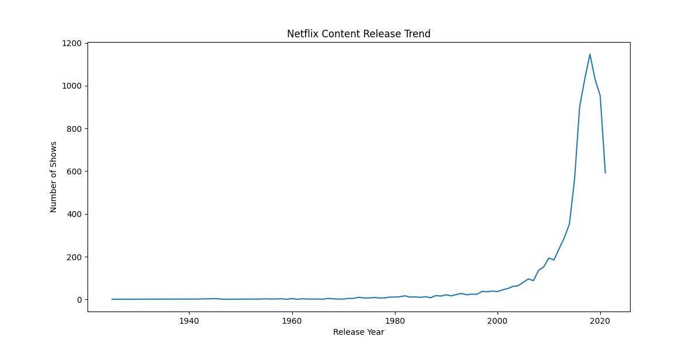
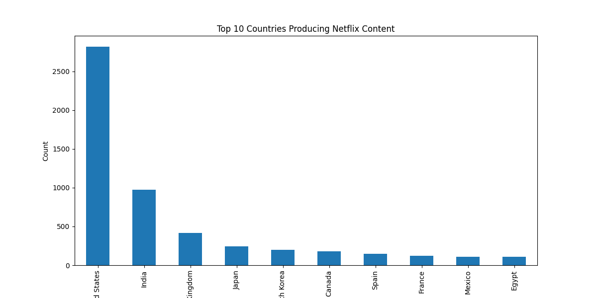
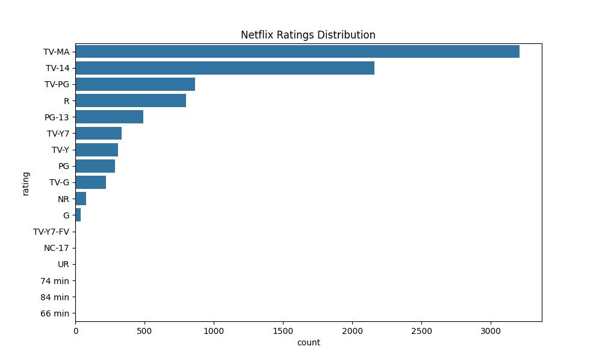
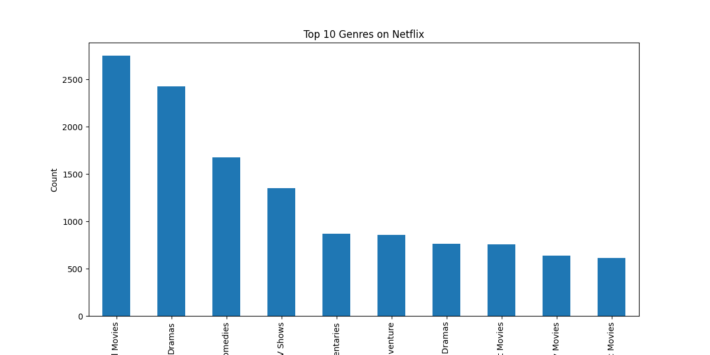
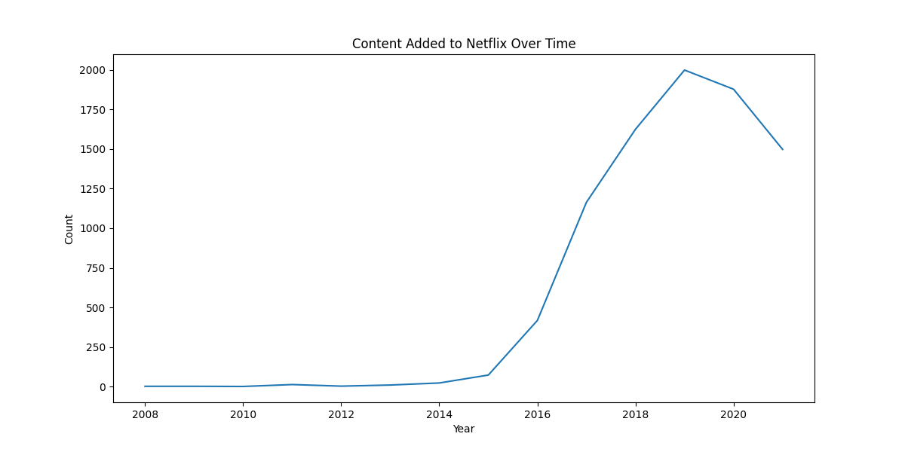

# 🎬 Netflix Exploratory Data Analysis (EDA)

## 📌 Project Overview

This project performs **Exploratory Data Analysis (EDA)** on the Netflix Titles Dataset to uncover trends, patterns, and insights related to Netflix movies and TV shows.

The analysis includes:
- Data cleaning
- Statistical summaries
- Trend analysis
- Visualizations
- Business insights

---

# 📂 Dataset Information

Dataset: Netflix Movies and TV Shows Dataset

Features include:
- Title
- Type (Movie / TV Show)
- Director
- Country
- Release Year
- Rating
- Genre
- Date Added
- Description

---

# 🎯 Objectives

- Analyze Netflix content distribution
- Compare Movies vs TV Shows
- Identify top producing countries
- Study release trends over years
- Analyze ratings and genres
- Generate meaningful insights through visualization

---

# 🛠️ Technologies Used

| Tool | Purpose |
|------|---------|
| Python | Programming Language |
| Pandas | Data Analysis |
| Matplotlib | Data Visualization |
| Seaborn | Statistical Visualization |
| VS Code | Development Environment |
| Git & GitHub | Version Control |

---

# 📊 Exploratory Data Analysis Performed

## ✔ Data Cleaning
- Removed duplicate records
- Handled missing values
- Converted date columns

## ✔ Statistical Analysis
- Dataset structure analysis
- Summary statistics
- Distribution analysis

## ✔ Visualizations
- Movies vs TV Shows
- Release year trends
- Top countries producing content
- Ratings distribution
- Top Netflix genres
- Content added over time

---

# 📈 Generated Visualizations

## Movies vs TV Shows



---

## Release Year Trend



---

## Top Countries Producing Content



---

## Ratings Distribution



---

## Top Genres



---

## Content Added Trend



---

# 🔍 Key Insights

- Netflix contains significantly more Movies than TV Shows.
- Content production increased rapidly after 2015.
- The United States contributes the highest amount of content.
- TV-MA is one of the most common ratings.
- Drama and International Movies dominate the platform.

---

# 🚀 Project Structure

```text
EDA_Project/
│
├── data/
│   └── dataset.csv
│
├── visuals/
│   ├── movies_vs_tvshows.png
│   ├── release_year_trend.png
│   ├── top_countries.png
│   ├── ratings_distribution.png
│   ├── top_genres.png
│   └── content_added_trend.png
│
├── eda.py
├── README.md
├── requirements.txt
└── .gitignore
```

---

# ▶️ How to Run the Project

## 1️⃣ Clone Repository

```bash
git clone https://github.com/your-username/netflix-eda-project.git
```

## 2️⃣ Open Project Folder

```bash
cd netflix-eda-project
```

## 3️⃣ Install Required Libraries

```bash
pip install -r requirements.txt
```

## 4️⃣ Run the Project

```bash
python eda.py
```

---

# 📌 Requirements

```text
pandas
matplotlib
seaborn
numpy
```

---

# 🎓 Learning Outcomes

Through this project, I improved my skills in:

- Data Cleaning
- Data Visualization
- Exploratory Data Analysis
- Insight Extraction
- Python Programming
- GitHub Project Management

---

# 📬 Conclusion

This project demonstrates how Exploratory Data Analysis can be used to understand content trends and generate actionable insights from real-world datasets.

The project helped strengthen analytical thinking and practical data analysis skills.

---

# ⭐ Author

Dushyan S
